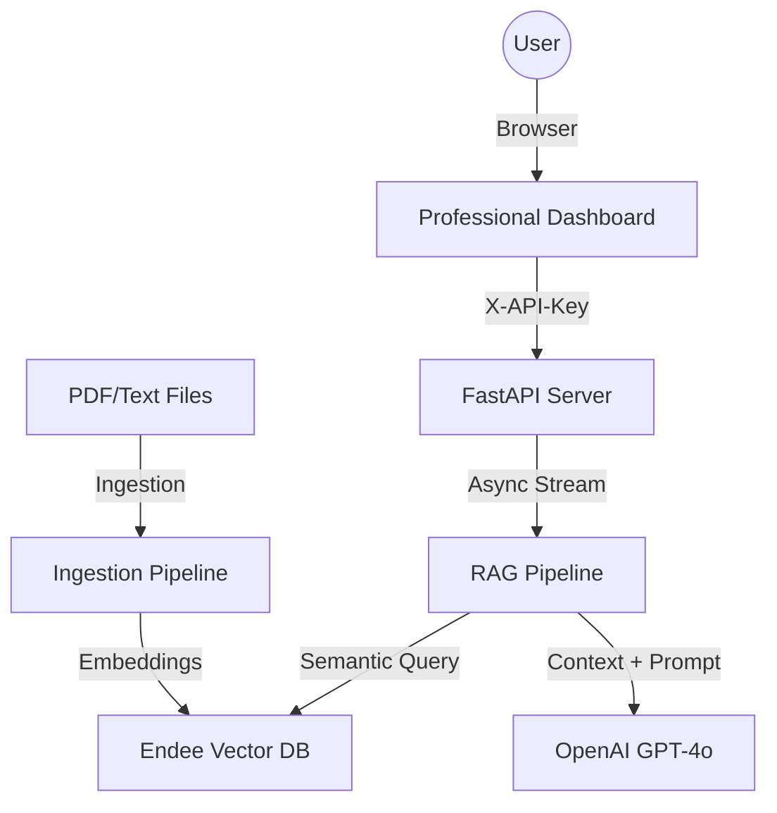

# ⚡ Endee RAG: Enterprise-Grade AI Knowledge Platform

[](#architecture)
[](#tech-stack)
[](#getting-started)

**Endee RAG** is a high-performance, Retrieval-Augmented Generation (RAG) platform designed for startups and enterprises that need to transform static documents into interactive, intelligent knowledge bases.

---

## 🚀 Quickstart: Launching the App (Windows/Mac/Linux)

Follow these exact steps to start the application.

### 1. Set Your OpenAI API Key
Open the file named **`.env`** in your project folder and replace the placeholder text with your real key:
```env
OPENAI_API_KEY=sk-proj-YOUR_ACTUAL_KEY_HERE
```

### 2. Start the Application
Open your terminal (PowerShell for Windows) and type this **exact** command:
```powershell
.\run.bat
```
> [!IMPORTANT]
> - **Windows Users**: You MUST include the `.\` before `run.bat` for it to work in PowerShell.
> - **Mac/Linux Users**: Run `sh run.sh`.

### 3. Access Dashboard
The launcher will automatically open your browser. If it doesn't, navigate to:
**[http://localhost:5000](http://localhost:5000)**

---

## 👔 For Stakeholders & CEOs
- **Instant ROI**: Reduce search time across internal documents by 90% with private, context-aware AI.
- **One-Click Deployment**: Zero-config startup for employees. No complex terminal commands required.
- **Data Privacy**: Built with enterprise middleware (API Keys) to keep your data under your control.
- **Elite Experience**: Premium dashboard with real-time streaming, citations, and conversational memory.

---

## 🛠️ For Engineering Teams
- **Pure Python Backend**: Powered by FastAPI and Uvicorn for maximum async performance.
- **Endee Vector Engine**: State-of-the-art vector similarity search (C++ based).
- **Lazy Loading**: Heavy AI models load on-demand, ensuring **instant** server startup.
- **Modular Pipeline**: Parallel PDF processing with semantic chunking and re-ranking.

---

## 🏗️ Technical Architecture



---

## 🐳 Deployment (Docker)

For production environments, use the provided Docker Compose:

1. **Configure Environment**:
   ```bash
   cp .env.example .env
   # Edit .env with your OpenAI and App keys
   ```

2. **Launch with Docker**:
   ```bash
   docker-compose up -d --build
   ```

3. **Verify Health**:
   ```bash
   curl http://localhost:5000/health
   ```

---

## 🔒 Security & Scaling
- **Authentication**: All sensitive endpoints require an `X-API-Key` header.
- **Validation**: Strict input validation using Pydantic V2.
- **Audit Trails**: Structured logging via Loguru for enterprise observability.
- **Scaling**: Stateless API design for horizontal scaling behind a Load Balancer.

---

## 🛡️ Troubleshooting (Common Errors)

- **`ModuleNotFoundError: No module named 'uvicorn'`**: Do NOT run `python run.py`. Always use `.\run.bat`. The batch file automatically sets up the "Virtual Environment" with all tools.
- **`Command 'run.bat' not recognized`**: You must prefix the command with `.\` (dot backslash) so the computer knows to look in the current folder.
- **`Connection Refused`**: Close any other terminal windows running the app and restart `.\run.bat`.

---
**Developed with focus on visual excellence and engineering rigor. Prepared for private cloud or local edge deployment.**
